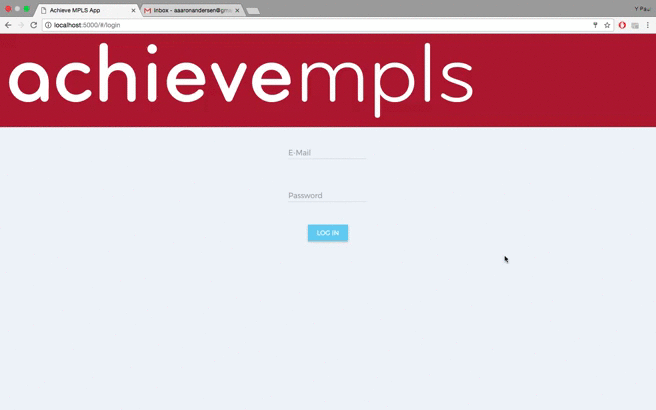
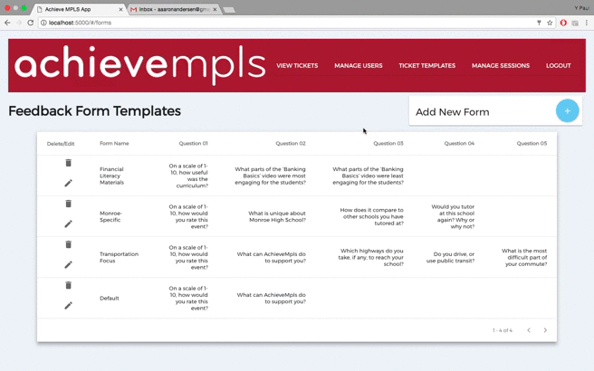
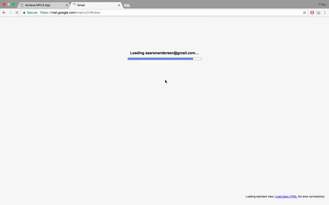

# achieve mpls Coach Experience Application

The Coach Experience Application for achieve mpls is a full stack application that digitizes the process of delivering, filling out, collecting, and analyzing feedback forms for the achieve mpls coaching program.  The application features an desktop oriented admin view that allows the administrator to manage users, create and assign forms, and set up the new school year.  There is also a mobile-first coach view that allows the coaches to complete forms that are assigned to them.  This application helps ease the strain on administrators for form delivery and collection, makes it more likely that the coaches will fill out and return the forms, and gives the administrators a way to interact with the completed forms.

---

In order to generate and send emails from within the app, the following variables will need to have replacements that are proprietary to the organization:

## in mail.js
lines 11-14:
var transporter = nodeMailer.createTransport({
    service: 'MAILSERVICE',
    auth: {
        user: 'EMAILADDRESS',
        pass: 'PASSWORD'
    }
});

and
lines 49-54:
var mailOptions = {
   from: '"achieve mpls" EMAILADDRESS',
   to: mailer.email,
   subject: 'Welcome to Achieve Mpls!',
   text: 'Thank you for volunteering for AchieveMpls, ' + mailer.fname + '! To activate your account, please click here: ' + 'HOSTING PLATFORM'
};

## Demo
### Sessions and Forms

  

### Events and Users

  

### Submit and Access Feedback

  

## Built With:
Javascript
Node
Node Mailer
Express
Grunt
Angular
Angular Routes
Angular Materials
PostgresSQL
Postico
Heroku

## Version:
1.0.0

## Authors:
Kevin Dahlberg, Emily Hoang, Teigen Leonard and Y Paul Sussman

## Acknowledgments:
Our instructors at Prime Digital Academy: Scott Bromander, Chris Black and Luke Schlangen

## Inspiration:
Amy Shapiro and the staff at achieve mpls!
